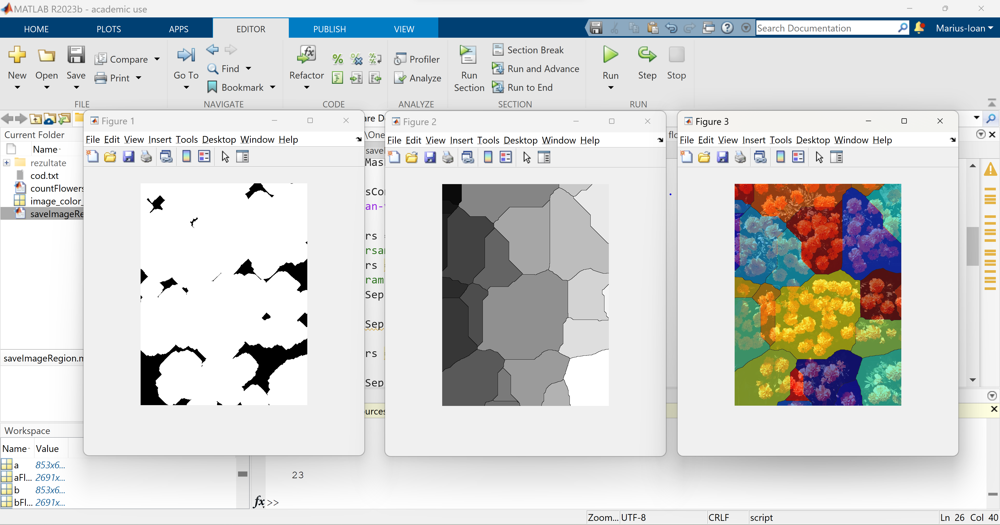

# Count Objects From The Image With MATLAB

The goal of this project was to count objects in an image, where there are also overlapping objects, which will increase the difficulty of detecting their exact number.

To be more precise, I count the number of flowers from an image. The challenging part was that the flowers were very close to each other, and many of them intersected.

Bellow there is the <b>original image</b> on left and the <b>segmentation process</b> of the MATLAB on the right.

  
  

## Final number of flowers result

## The segmentation process

#### Segmentation using region picker

#### Trying to find the right bias value

  
  

